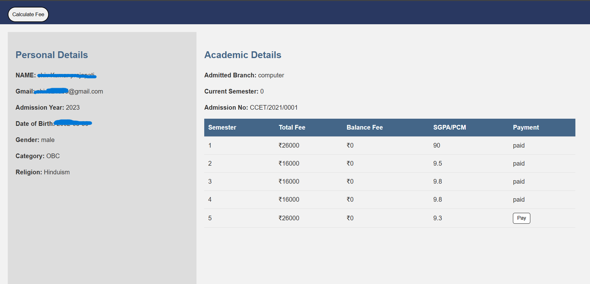
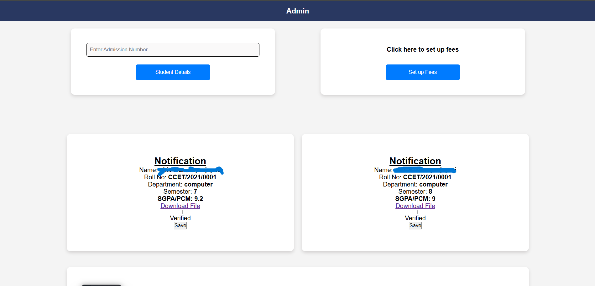
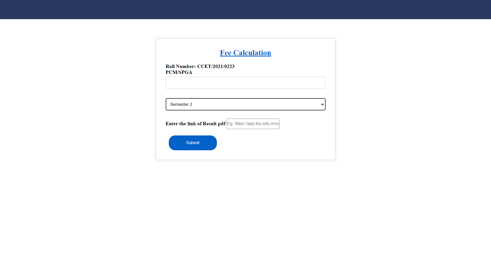
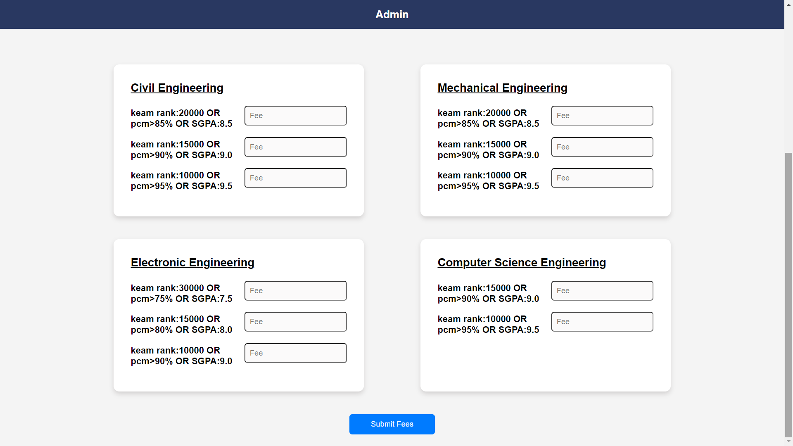

# Smart Fee System

The **Smart Fee System** is a web-based application designed to streamline and automate college fee management by linking fee calculation with student academic performance. This system enhances transparency, encourages academic excellence, and reduces manual workload for both students and administrative staff.

## 🚀 Features

- 🎓 **Performance-Based Fee Calculation**  
  - First semester fees based on PCM percentage.
  - From the second semester onwards, fees are calculated using SGPA.
  
- 📤 **Document Upload**  
  - Students can upload academic results to initiate fee calculations.

- 💰 **Scholarship Eligibility**  
  - System evaluates predefined criteria and applies scholarships automatically.

- 🔒 **Role-Based Access**  
  - Separate views and actions for Admin and Students.

- 🧾 **Accurate & Fair**  
  - Reduces manual errors, increases fairness, and promotes efficiency.


---

## 🛠️ Technologies Used

- **Frontend:** HTML, CSS, JavaScript (Vanilla)
- **Backend:** Node.js, Express.js
- **Database:** MongoDB
- **Templating Engine:** EJS

---

## 🧑‍💻 Setup Instructions

1. **Clone the repository**
   ```bash
   git clone https://github.com/Shiv2385/Smart-Fee-System.git

2. **Install dependencies**

   ```bash
   npm install

3. **Configure the database**

   * Ensure MongoDB is running locally or provide a MongoDB Atlas URI.

4. **Run the application**

   ```bash
   npm start
---

## 📷 Screenshots

### 1. Sign Up Page


### 2. Login Page


### 3. Student Details


### 4. Admin Home
=

### 5. Mark Input


### 6. Set Fee Structure



---

## 📌 Key Benefits

* Encourages academic excellence by linking performance to fees.
* Ensures scholarship eligibility is automatically evaluated.
* Simplifies fee processing for administrators.
* Reduces financial errors and ensures correct fee allocation.
